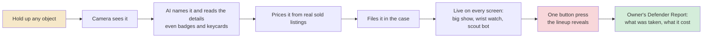
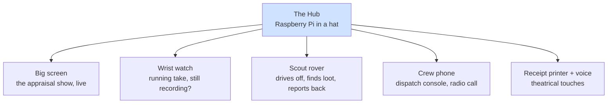
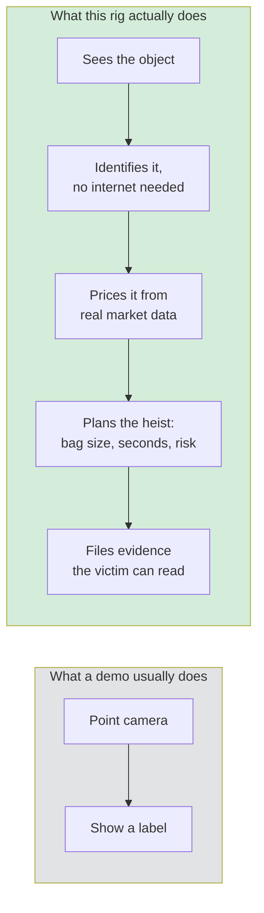

# Appraisal Job: system flowcharts

Business-readable views. Render on GitHub, mermaid.live, or any Mermaid-enabled slide tool.

## 1. What it does, in one line



## 2. One hub, many devices



## 3. Why it is hard



## Stack badges

Skillicons strip, one image:

```markdown

```

Shield badges, fuller list:

```markdown


```
